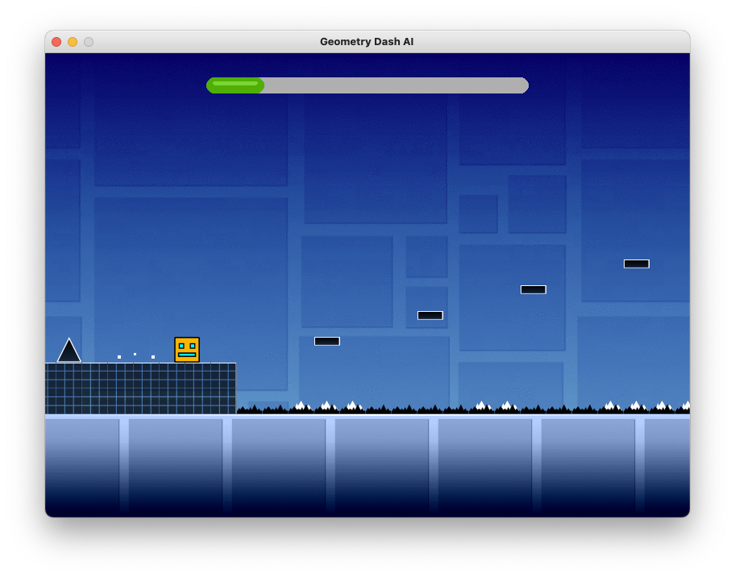

# Geometry Dash AI



## Setup

```sh
# installs pygame
pip install requirements.txt
```

## Usage

```sh
python main.py
```

## TODO

- [ ] Figure out square rotating glitch
- [ ] Finish testing element mapping
- [ ] Render portals
- [ ] Test fly/gravity portals (gravity too strong)
- [ ] Implement AI using generative learning (`JumpControllerAI` in `jump_controller.py`)
- [x] Progress bar
